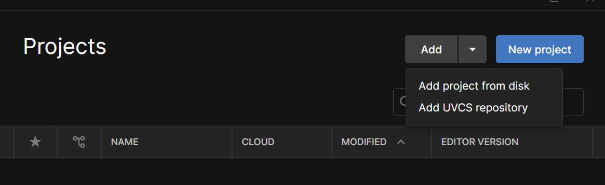
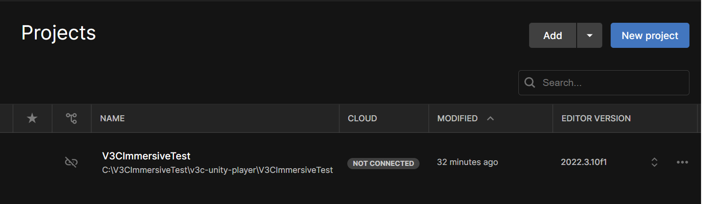

<h1 align="center">V3C Immersive Platform - Unity Player</h1>
<p align="center">
  
  
</p>

# Introduction

This project provides a Unity package to decode and play V3C contents in Unity, using the [V3C Immersive Platform - Decoder Plugin](https://github.com/5G-MAG/rt-v3c-decoder-plugin). Also provided in that repository are V-PCC and MIV synthesizers plugins needed for the rendering of the V3C contents. 

This project also includes a simple Unity project showcasing how to use the package. It supports both Windows and Android targets.  

## Requirements

Unity 6000.0.25f1 (with Android build support if you plan on testing on Android phones)

### Windows
A device with an NVIDIA GPU card supporting hardware HEVC decoding (CUVID) and OpenGL Core 4.5 is expected.  You can check if your graphic card has the right decoder here: [Video encode and decode GPU support](https://developer.nvidia.com/video-encode-and-decode-gpu-support-matrix-new).

### Android
A device supporting OpenGL ES 3.2 and HEVC hardware decoding (MediaCodec) is expected.  

## Cloning  

To clone the project, use this command line:

```shell
git clone https://github.com/5G-MAG/rt-v3c-unity-player  
```

## Decoder plugin installation

This project uses the V3CImmersivePlatform Decoder plugin, available [here](https://github.com/5G-MAG/rt-v3c-decoder-plugin). To rebuild the v3c-decoder-plugin, please following the instruction in that repository and deploy the compiled libraries into the package.  

Libraries should be copied from the v3c-decoder-plugin project. To do so, it is recommended to use the script `/Scripts/copy_libs.sh` provided in the v3c-decoder-plugin project.

### Windows

```shell
cd rt-v3c-unity-player
../rt-v3c-decoder-plugin/Scripts/copy_libs.sh ./Packages/V3CDecoder/Runtime/Plugins release Windows
```

The above script, copy_libs.sh, will copy all the DLLs from rt-v3c-decoder-plugin/Output/Windows/Release/x86_64 to rt-v3c-unity-player/Packages/V3CDecoder/Runtime/Plugins 

### Android

```shell
cd rt-v3c-unity-player
../rt-v3c-decoder-plugin/Scripts/copy_libs.sh ./Packages/V3CDecoder/Runtime/Plugins release Android
```

The above script, copy_libs.sh, will:

- Copy the jar file V3CImmersiveDecoderVideo.jar
from ./rt-v3c-decoder-plugin/Output/Android/V3CImmersiveDecoderVideo.jar to rt-v3c-unity-player/Packages/Runtime/Plugins/android/libs
- Copy all the .so files  
from ./rt-v3c-decoder-plugin/Output/Android/Release/arm64-v8a/\*.so to rt-v3c-unity-player/Packages/V3CDecoder/Runtime/Plugins/android/libs/arm64-v8a
from ./rt-v3c-decoder-plugin/Libraries/Android/Release/arm64-v8a/*.so to rt-v3c-unity-player/Packages/V3CDecoder/Runtime/Plugins/android/libs/arm64-v8a

## Launching the Unity Player

Add the Unity Player project via Unity Hub (Add / Add project from disk).



Select the directory "rt-v3c-unity-player/V3CImmersiveTest" and click "Add Project"



Then select "V3CImmersiveTest" to launch Unity.

### Settings

To run (and build) the Unity test project, or any project using the V3CDecoderPackage, you need to set the following Unity player settings (Edit -> Project Settings -> Player)

- Graphics APIs for Windows -> OpenGLCore (for Windows)
- Graphics APIs -> OpenGLES3 (for Android)
- Android scripting backend -> IL2CPP, then set the target platform to arm64-v8a

Note: these settings are checked automatically when importing the package and errors should pop up in the Unity Console as long as they are not correctly set.

## Building the Demo Scene in Unity

Check that the project is opened with the Scene "V3C Simple Player"
If this is not the case, select Assets/Scenes to load the V3C Simple Player scene. You can also open the scene from "File/Open Scene/" and select Scenes/V3C-Simple Player.unity

### Windows

Go to File->Build Settings (or Ctrl+Shift+B), select the Standalone Windows target and select either Build or Build and Run.

You will be asked to chose a directory which will contain the .exe and all the necessary files, we strongly suggest you choose an empty directory for that.

### Android

Go to File->Build Settings (or Ctrl+Shift+B), select the Android target and select either Build or Build and Run.

Unity will generate a .apk file that you can copy and install on your phone. To use the Build&Run feature, you will need to activate the Debug through USB feature on your device (requires developper mode).

Note that you will need to manually install the content and/or configuration files on your device. Run the application once on your device to ensure the creation of the folder.

## Example configuration and V3C Test Contents

Example configuration and V3C test contents are available in the [rt-v3c-content](https://github.com/5G-MAG/rt-v3c-content).  
The **README.md** in this repository provides useful information on V3C test content in "on-device-data" and "on-server-data" folders and JSON configuration files (config.json and library.json).
This repository is also accessible via `rt-v3c-decoder-plugin/V3C-Content` GIT submodule.

### Local data setup

The content in the `rt-v3c-decoder-plugin/V3C-Content/on-device-data` folder (both "config.json" file and "data" folder) is to be copied in the Unity project local data folder located here:

#### Windows

`C:/Users/[your-user-name]/AppData/LocalLow/InterDigital/V3CSimplePlayer/`

(needed for testing in the Unity Editor and for the compiled project)

#### Android

`file/storage/emulated/0/Android/data/com.InterDigital.V3CSimplePlayer/files` 

or `Android/data/com.InterDigital.V3CSimplePlayer/files`

(according to the smartphone)

### Remote data setup

The content of the `rt-v3c-decoder-plugin/V3C-Content/on-server-data` folder is to be copied in a DASH server.  
You may follow **README_dash_server.md** present in the "V3C-Content" folder to set-up your own DASH Server.
You need then to edit config.json:

```
  "Networking": {  
    "Servers": [  
      {  
        "Name": "myserver", <= replace with your server name
        "IP": "127.0.0.1",   <= replace with IP address of your server
        "Port": 8080,        <= replace with port number of your server
        "MaxConnections": 10  
      }  
    ],  
    "SegmentsBufferCapacity": 4  
  },  
```

Then update your library.json file for the content present on your server:

```
{
      "BaseDirectory": "S41C2RAR05_footprod_R24",
      "Mode": "dash",
      "Name": "S41C2RAR05_footprod_R24 Remote 1GOP",
      "StreamList": [
        {
          "Duration": [

          ],
          "NbFrame": [

          ],
          "NbSegment": 4,
          "Path": "S41C2RAR05_footprod_%04d.bin",
          "ServerName": "myserver",                                <= put your server name
          "Type": "vpcc",
          "Url": "XXX/S41C2RAR05_footprod_1GOP/stream.mpd" <=  replace XXX with the path of the content on your DASH Server
          }
      ]
    },
```

## Running the Unity Player with Demo Content

Once the demo content is setup, press Play in the Editor and the application should run without issues.


UI Controls:

- Press the Play button on the left of the screen to load the first stream (VPCC Football player with the test content). Press it again to stop the decoder.
- Press the Next arrow to load the second stream (MIV MVD Dance)
- Press the Next arrow to load the third stream (MIV MPI Mannequin)
- Press the Next arrow to load the first stream (VPCC Football player) streamed by your DASH Server
- Press the Next arrow to load the second stream (MIV MVD Dance) streamed by your DASH Server
- Press the Next arrow to load the third stream (MIV MPI Mannequin) streamed by your DASH Server
- You can press the circling arrow to reset the camera, and Previous arrow to come back to the previous content

V-PCC:

- Rotate the camera around the model : Left click and drag (Windows) / Single finger swipe (Android)
- Move towards the model: Scroll wheel (Windows) / Two finger pinch (Android)

MIV:

- Move (x/y plane): Left click and drag (Windows) / Single finger swipe (Android)
- Rotate (x/y axis): Right click and drag (Windows) / Double finger swipe (Android)
- Zoom: Scroll wheel (Windows) / Two finger Pinch (Android)

## FAQ

If you have any questions on the setup or the usage of the V3C Immersive Platform, please consult the [FAQ page](./docs/FAQ.md).  

## Licenses

This project is provided under 5G-MAG's Public License. For the full license terms, please see the LICENSE file distributed along with the repository or retrieve it from [here](https://drive.google.com/file/d/1cinCiA778IErENZ3JN52VFW-1ffHpx7Z/view).  

External dependencies:

- This project uses softwares from the [v3c-decoder-plugin](https://github.com/5G-MAG/rt-v3c-decoder-plugin), check licenses in that project before using it.
